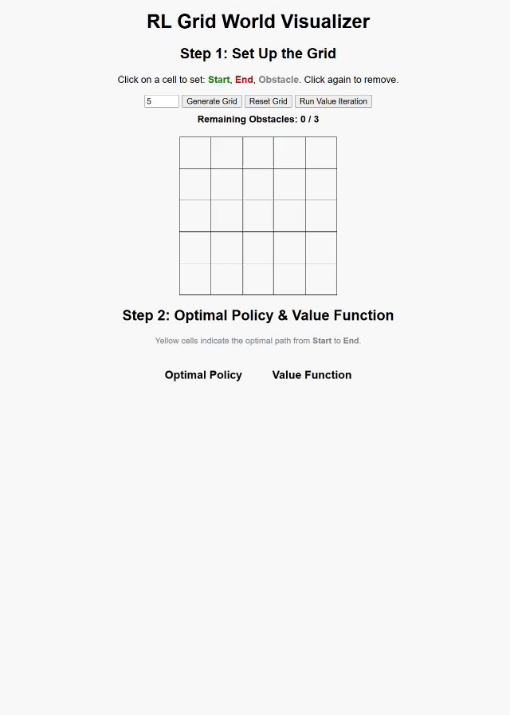

# HW2 : Solve Gridworld Problem using Value Iteration

## 本作業（HW2）是延續 [HW1 作業](https://github.com/smo612/HW1_7113064188) 作業 基礎所製作，並進一步實作 價值迭代演算法（Value Iteration），用以自動推導出每個狀態下的最佳策略（Optimal Policy） 及對應的價值函數（Value Function）。  
- 起點、終點、障礙物的設定邏輯與互動方式皆沿用自 HW1。
- 前端使用介面（HTML / CSS / Grid 操作）與 HW1 相似。
- 格子n數範圍由5-9改為3-7

## **目錄架構** 
```bash
grid-map-flask-app/
├── app.py                # Flask 主程式
│
├── static/               # 靜態檔案 (CSS, JS, 圖片等)
│   ├── style.css         # 自訂 CSS 樣式
│   └── script.js         # JavaScript 控制互動邏輯
│
├── templates/            # HTML 模板
│   └── index.html        # 主畫面 (表單 + 動態網格)
│
└── README.md             
```


### ✅ 差異重點比較

| 功能項目       | HW1                                  | HW2                                                  |
|----------------|--------------------------------------|------------------------------------------------------|
| **策略來源**   | 根據終點方向或隨機選擇行動          | 每格選擇使 V(s) 最大的方向（最佳化）                |
| **價值計算方式**| 固定策略下進行評估                  | 使用價值迭代持續改善策略                            |
| **演算法類型** | 僅做策略評估（Policy Evaluation）   | **價值迭代（Value Iteration）**                    |
| **結果呈現**   | 顯示箭頭與價值數值                  | 額外標出黃色最佳路徑               |
---


## 操作影片
 
